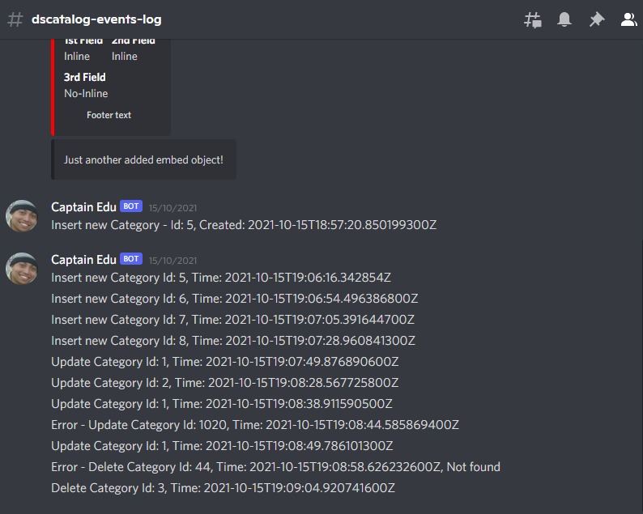

# ws-bootcamp
Projeto desenvolvido no BootCamp da DevSuperior

O projeto consiste em desenvolver uma aplicação de vendas utlizando o Spring como back end e React como front end. Após o desenvolvimento, será feito o deploy da aplicação, 
cujo back end está no Heroku e o front no Netlify.

Em sua implementação, utilizou-se o padrão de camadas:


Aplicou-se o JUnit para criação de testes utilizando o Padrão AAA (Arrange-Act-Assert). Foram realizados:
- Teste de Integração
- Teste de Unidade para classes services utilizando mockito (Fazer testes de classes sem instanciar componentes que ela precise)

No que diz respeito à Banco de Dados, foi utilizado:
- o H2 para banco de teste
- o PostgreSQL para banco de desenvolvimento e produção

E durante o projeto e acrescentei mais features:

Utilização do shell para automatizar os commits
```
echo "Inserindo modificações no github"
read -p "Informe o nome do commit: " commit_name
read -p "COMMIT NAME: '${commit_name}'. Deseja continuar? [n/S]: "  answer
if [ "$answer" = "S" ] || [ "$answer" = "s" ]; then
    git add .
    git commit -m "${commit_name}"
    git push
else
    echo "Operação cancelada"
fi  
echo "Fim da execução"

read -p "Pressione alguma tecla para encerrar...."  answer
```

Utilização do discord através dos webhooks para notificar:

- atualizações no git 


- logs do sistema


